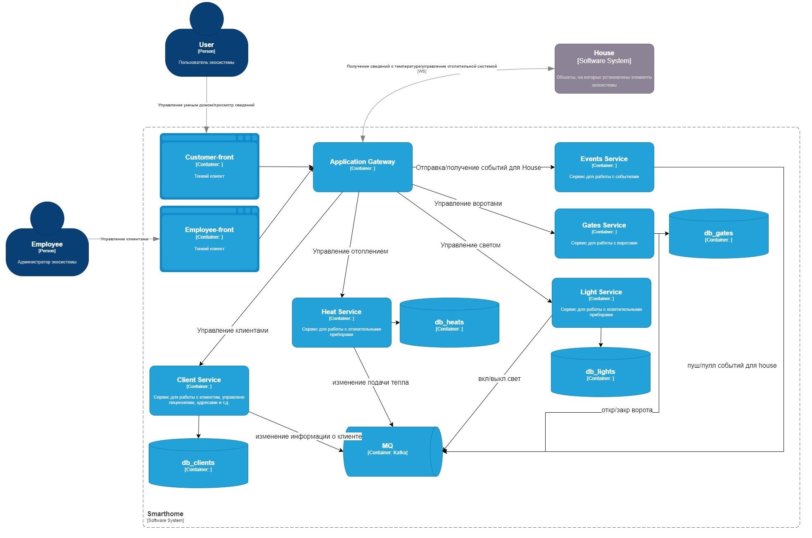

Это шаблон для решения **первой части** проектной работы. Структура этого файла повторяет структуру заданий. Заполняйте его по мере работы над решением.

# Задание 1. Анализ и планирование

Чтобы составить документ с описанием текущей архитектуры приложения, можно часть информации взять из описания компании условия задания. Это нормально.

### 1. Описание функциональности монолитного приложения

**Управление отоплением:**

- Пользователи могут изменять температуру отопления в собственном доме
- Система поддерживает возможность отображение текущего состояния датчиков температуры
- Система автоматически отключает отопление при достижении температуры, указанной пользователем  

**Мониторинг температуры:**

- Пользователям доступно отображение текущей температуры в доме
- Пользователям доступна статистика использования отопления по периодам, с отображением конкретного значения температуры
на период времени
- Глубина хранения данных 3года

### 2. Анализ архитектуры монолитного приложения

Система представляет из себя монолитное приложение, с тех. стеком:
- Java 17
- Postgresql 15.5.20

Взаимодействие пользователя с системой осуществляется синхронно.

### 3. Определение доменов и границы контекстов

- Домен отопительной системой (вкл, выкл, изменить мощность)
- Домен температуры (отображение значений, максимально допустимые значения для экстренного отключения системы отопления)

### **4. Проблемы монолитного решения**

На текущий момент решение в виде монолита может спокойно справляться, т.к. нагрузка не велика, а функционал умного дома 
ограничен лишь отоплением.
НО! Поскольку, целевая экосистема включает гораздо бОльшие возможности и функционал, то текущее решение не будет 
нормально масштабироваться, отвечать скорости обработки запросы, и тем более наблюдать за домом (real-time stream).

Также отсутствует UI, который должен, при необходимости, масштабироваться отдельно от серверной части.

Резюмируя, если бы функционал был ограничен только текущими (отопление/датчики температуры), монолита было бы достаточно.
Для дальнейшего развития экосистемы монолит непригоден.

### 5. Визуализация контекста системы — диаграмма С4

# Задание 2. Проектирование микросервисной архитектуры

В этом задании вам нужно предоставить только диаграммы в модели C4. 
Мы не просим вас отдельно описывать получившиеся микросервисы и то, 
как вы определили взаимодействия между компонентами To-Be системы. 
Если вы правильно подготовите диаграммы C4, они и так это покажут.

**Диаграмма контейнеров (Containers)**

**Диаграмма компонентов (Components)**

**Диаграмма кода (Code)**

# Задание 3. Разработка ER-диаграммы

### db-clients

### db-gates

### db-heats

### db-lights
